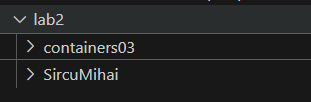
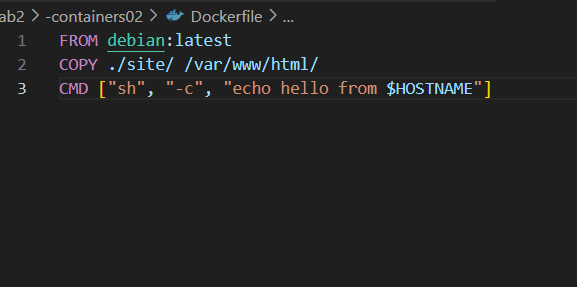
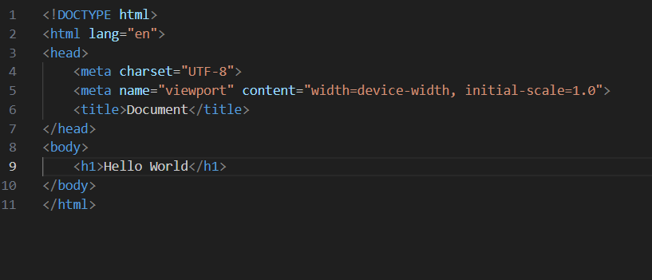
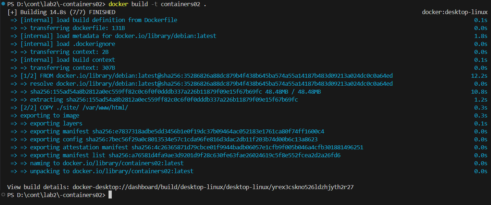
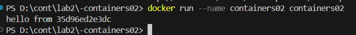
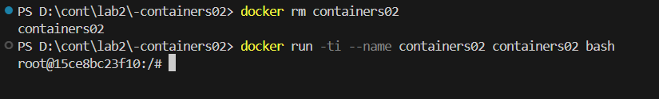
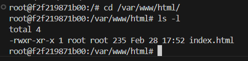

## Prima aplicație Docker
## Scopul: 
- Aceasta lucrare de laborator familiarizează cu elementele de bază ale containerizării și pregătește spațiul de lucru pentru următoarele lucrări de laborator.
## Sarcina:
- Instalarea Docker Desktop și verificarea funcționării acestuia.
## Executarea:
# Copierea repositoriului containers03 din github
- 
# Crearea fisierului Dockerfile cu continutul:
- FROM debian:latest
- COPY ./site/ /var/www/html/
- CMD ["sh", "-c", "echo hello from $HOSTNAME"]   
- 
# Crearea directorlui site cu fisierul index.html
- 
# Crearea imaginii cu comanda: docker build -t containers02 .
- Cât timp a durat crearea imaginii?
- Crearea imaginii a durat 14,8 s.
- 
# Pornim imaginiea cu comanda: docker run --name containers02 containers02
- Ce a fost afișat în consolă?
- In terminal sa afisat un raspuns de la cotainer02 cu adresa lui.
- 
# Stergem containerul si il repornim cu comnzile:
- docker rm containers02
- docker run -ti --name containers02 containers02 bash
- 
# In fereastra deshisa executam:
- cd /var/www/html/
- ls -l
- Ce este afișat pe ecran?
- La ecran sau afisat permisiunile si detinatorul fisierului index.html
- 
## Conslusie
- Această lucrare de laborator ofară o introducere practică în containerizare prin utilizarea Docker Desktop. În ea sa parcurs procesul de instalare și configurare a Docker Desktop, crearea unui fișier Dockerfile, construirea unei imagini și rularea unui container. De asemenea, am explorat modul în care fișierele sunt copiate și gestionate în cadrul containerului.